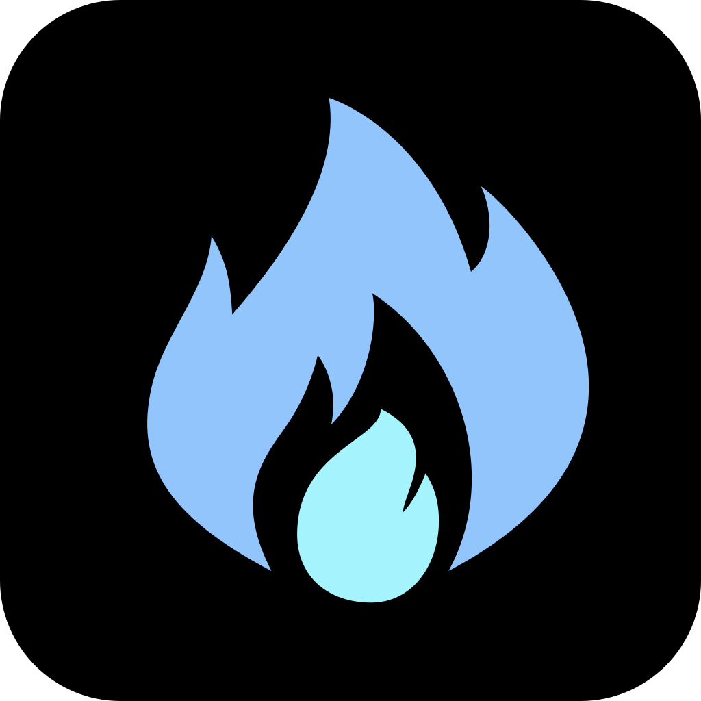

<div align="center">
  <picture>
    <source media="(prefers-color-scheme: dark)" srcset="assets/icons/app.png" />
    <source media="(prefers-color-scheme: light)" srcset="assets/icons/app-dark.png" />
    
  </picture>

  <h1>FireChat</h1>

  <p><strong>Open AI client</strong></p>

  <p>
    <a href="./README.zh-CN.md"><strong>中文</strong></a>
    <span> · </span>
    <a href="./README.md"><strong>English</strong></a>
  </p>

  <p>
    
    
    
    
  </p>
</div>

<p align="center">
  <a href="#features">Features</a>
  <span> · </span>
  <a href="#quick-start">Quick Start</a>
  <span> · </span>
  <a href="#configuration">Configuration</a>
  <span> · </span>
  <a href="#project-structure">Project Structure</a>
</p>

---

## ✨ Features

<table>
  <tr>
    <td width="50%">
      <strong>Multi-provider access</strong>
      <br />
      Connect many mainstream AI providers in one client.
    </td>
    <td width="50%">
      <strong>OpenAdapter tools</strong>
      <br />
      Extend chat with web search, page fetch, and crawl tools.
    </td>
  </tr>
  <tr>
    <td width="50%">
      <strong>Document attachment parsing</strong>
      <br />
      Parse common documents into chat context.
    </td>
    <td width="50%">
      <strong>Custom providers</strong>
      <br />
      Add custom OpenAI-compatible providers.
    </td>
  </tr>
  <tr>
    <td width="50%">
      <strong>Sessions and logs</strong>
      <br />
      Manage local conversations and inspect recent requests.
    </td>
    <td width="50%">
      <strong>Local API proxy</strong>
      <br />
      Route provider requests through a local proxy.
    </td>
  </tr>
</table>

## 🚀 Quick Start

### Requirements

| Item | Requirement |
| --- | --- |
| Node.js | 20+ |
| Package manager | npm |

### Start

```bash
npm install
npm run electron:dev
```

### Commands

| Command | Description |
| --- | --- |
| `npm run electron:dev` | Start the desktop development environment |
| `npm run build` | Build the renderer |
| `npm run electron:build:win` | Build the Windows installer |
| `npm run check` | Run lint and typecheck |

## ⚙️ Configuration

| File or entry | Description |
| --- | --- |
| `.env` / `.env.local` | Startup defaults, see `.env.example` |
| `firechat.local.json` | Non-sensitive local config for providers, URLs, default models, and model lists |
| `firechat.auth.json` | Sensitive auth config for API keys and custom headers |
| Settings window | Main configuration entry, saved to local config files |

Notes:

- Custom providers support OpenAI format and OpenAI-compatible format.
- Development reads repo-root config files first.
- Packaged builds read user-data config files first.
- Clear app data does not delete `firechat.local.json` or `firechat.auth.json`.

## 🗂️ Project Structure

```text
apps/
  desktop/
    client/         app shell, feature UI, app controller, and desktop-facing services
    main/           Electron startup, windowing, IPC, proxy, and updater
    renderer/       Vite renderer entry, provider runtime, persistence clients, shared UI, styles
  shared/           cross-process shared constants and helpers
packages/
  contracts/        shared contracts and types
  core/             chat, provider, and settings core modules
  data/             SQLite persistence and storage repositories
  desktop-bridge/   desktop IPC channels and preload bridge
assets/
  icons/            app icon assets
build/
  installer.nsh     Windows installer script
```

## 💾 Local Data

- Conversations and part of the app state are stored locally.
- Auto update is disabled in development.
